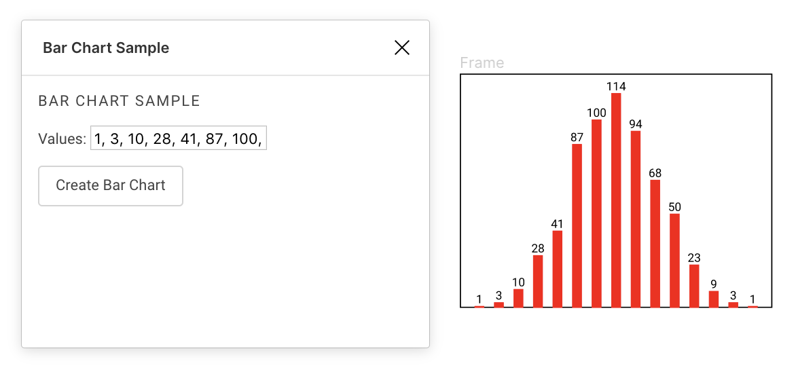
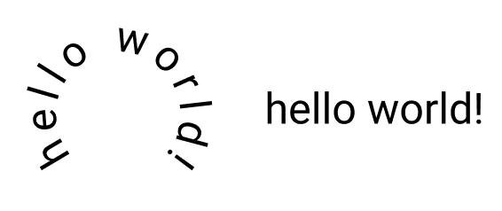
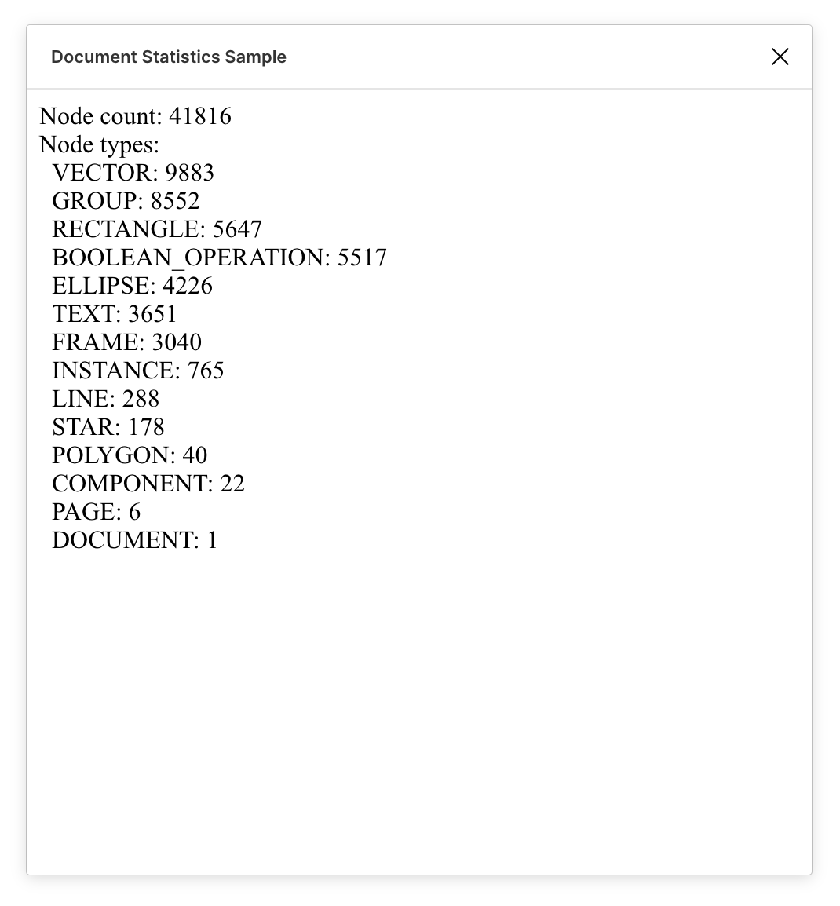
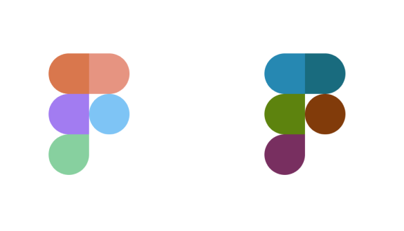
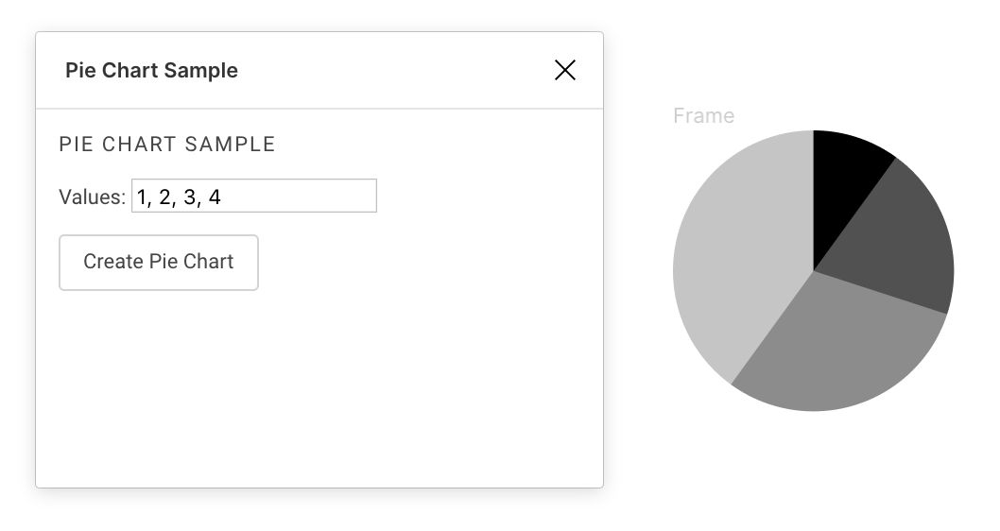
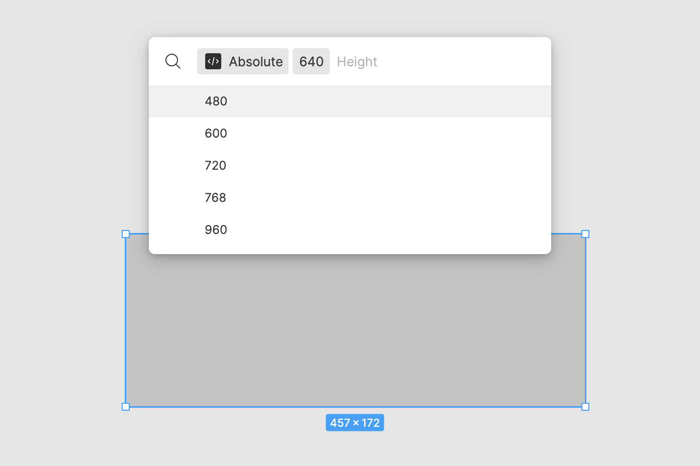
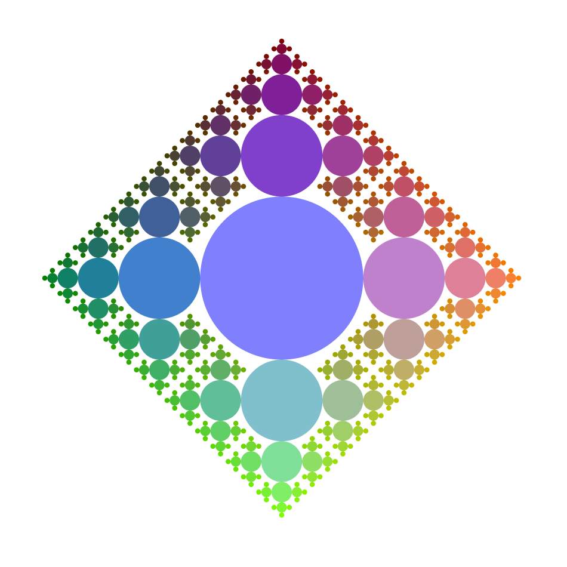
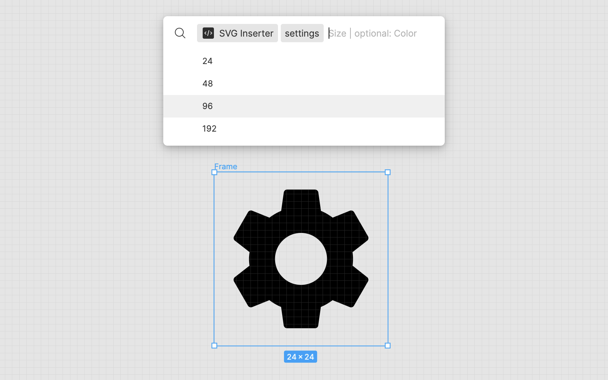
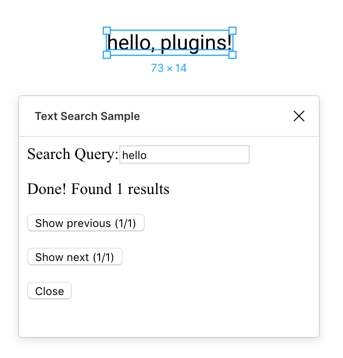
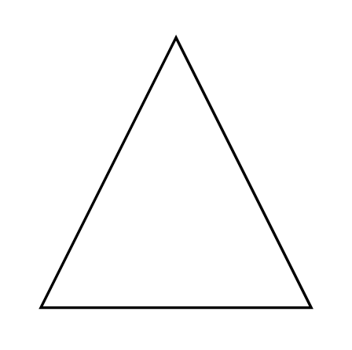

# 🔌 Figma Plugin Samples

Sample plugins using the [Figma Plugin API][docs].

To make a feature request, file a bug report, or ask a question about
developing plugins, check out the available [resources][help].

These plugins are written using [TypeScript][ts] to take advantage of Figma's
typed plugin API. This means that in order to run a plugin, you will first need
to compile the plugin code using the TypeScript compiler.

To install TypeScript, first [install Node.js][node]. Then:

    $ npm install -g typescript

Now, to compile the Bar Chart sample plugin (for example):

    $ cd barchart
    $ tsc

Now you can import the Bar Chart plugin from within the Figma desktop app!

The code for each plugin is in `code.ts` in that plugin's subdirectory. If a
plugin shows some UI, the HTML will be in `ui.html`.

For example, the code for the Bar Chart sample plugin is in
[barchart/code.ts](barchart/code.ts), and the HTML for its UI is in
[barchart/ui.html](barchart/ui.html).

## Bar Chart

Generates a bar chart given user input in a modal.

[Check out the source code.](barchart/)

## Circle Text

Takes a single text node selected by the user and creates a copy with the
characters arranged in a circle.

[Check out the source code.](circletext/)

## Document Statistics

Computes a count of the nodes of each `NodeType` in the current document.

[Check out the source code.](stats/)

## Invert Image Color

Takes image fills in the current selection and inverts their colors.

This demonstrates:

- how to read/write images stored in a Figma document, and
- how to use `showUI` to access browser APIs.

[Check out the source code.](invert-image/)

## Pie Chart

Generates a pie chart given user input in a modal.

[Check out the source code.](piechart/)

## Resizer (Parameter Only)

Resizes a selected shape. There are two submenus, allowing for absolute resizing and relative resizing.

[Check out the source code.](resizer/)

## Sierpinski

Generates a fractal using circles.

[Check out the source code.](sierpinski/)

## SVG Inserter (Parameter Enabled)

Inserts an SVG icon into the canvas. 

[Check out the source code.](svg-inserter/)

## Text Search

Searches for text in the document, given a query by the user in a modal.

This demonstrates:

- advanced message passing between the main code and the plugin UI,
- how to keep Figma responsive during long-running operations, and
- how to use the viewport API.

[Check out the source code.](text-search/)

## Vector Path

Generates a triangle using vector paths.

[Check out the source code.](vector-path/)

## Webpack

Creates rectangles. Demonstrates bundling plugin code using Webpack.

[Check out the source code.](webpack/)

## React 

Creates rectangles (same as the [Webpack sample plugin][webpack]).

This demonstrates:

- bundling plugin code using Webpack, and
- using React with TSX.

[Check out the source code.](react/)

## Vue 

Creates rectangles (same as the [Webpack sample plugin][webpack]).

This demonstrates:

- bundling plugin code using Webpack, and
- using Vue Single File Components.

[Check out the source code.](vue/)

[docs]: https://www.figma.com/plugin-docs
[help]: https://www.figma.com/plugin-docs/get-help
[ts]: https://www.typescriptlang.org/
[node]: https://nodejs.org/en/download/
[webpack]: #webpack

