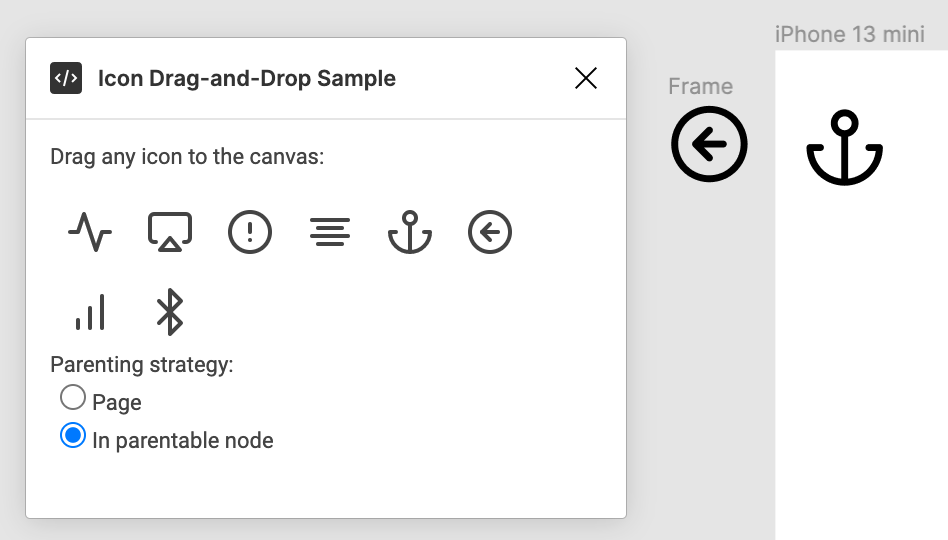
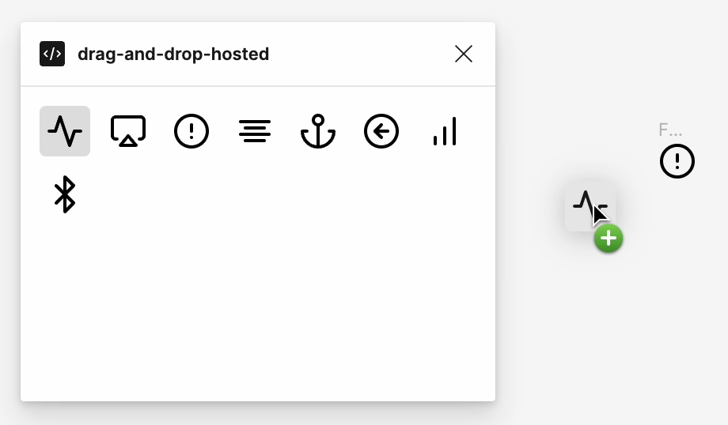
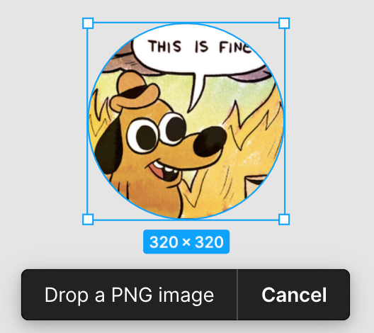
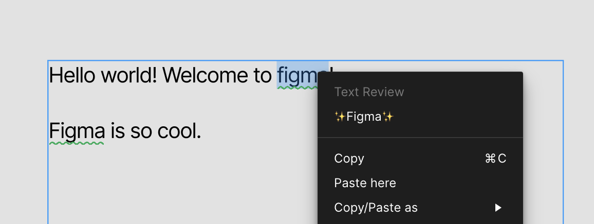
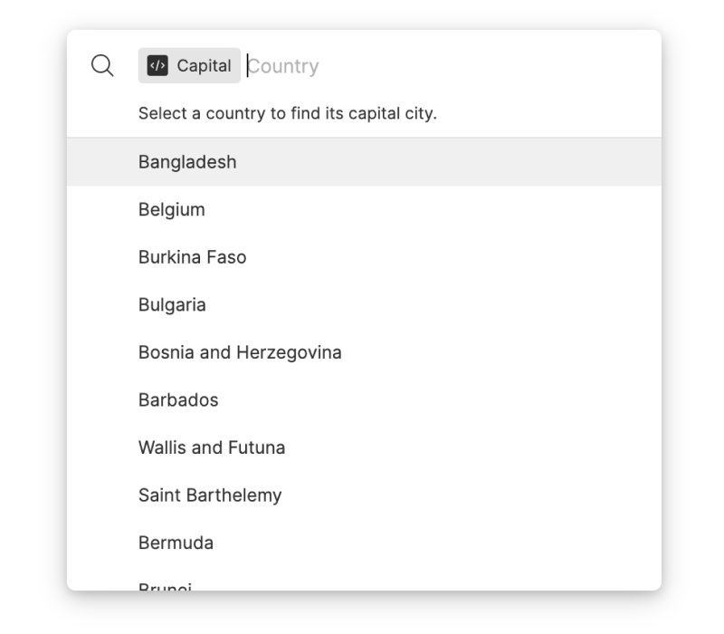

# 🍱 Figma + FigJam Plugin Samples

Sample plugins using the [Figma + FigJam Plugin API docs][docs].

To make a feature request, file a bug report, or ask a question about
developing plugins, check out the available [resources][help].

## DISCLAIMER:

The resources you see here are example plugin samples meant for Figma plugin development and FIGMA PROVIDES THEM "AS IS", WITHOUT WARRANTY OF ANY KIND. We don't promise they're perfect or will always work as you expect. We're not responsible for any problems you might experience from using them. It's up to you to check these samples out thoroughly and make sure they're safe and suitable for your needs before you use them. If something goes wrong, Figma won't be held responsible. If you keep using these samples, it means you're okay with these terms. **FIGMA EXPLICITY DISCLAIMS ANY IMPLIED WARRANTIES OF MERCHANTABILITY, FITNESS FOR A PARTICULAR PURPOSE, QUIET ENJOYMENT, AND NON-INFRINGEMENT AND ANY WARRANTIES ARISING OUT OF COURSE OF DEALING OR USAGE OF TRADE.**

## Getting Started

These plugins are written using [TypeScript][ts] to take advantage of Figma's typed plugin API. Before installing these samples as development plugins, you'll need to compile the code using the TypeScript compiler. Typescript can also watch your code for changes as you're developing, making it easy to test new changes to your code in Figma.

To install TypeScript, first [install Node.js][node]. Then:

    $ npm install -g typescript

Next install the packages that the samples depend on. Currently, this will only install the lastest version of the Figma typings file. Most of the samples will reference this shared typings file in their `tsconfig.json`.

    $ npm install

Now, to compile the Bar Chart sample plugin (for example):

    $ cd barchart
    $ tsc

Now you can import the Bar Chart plugin from within the Figma desktop app (`Plugins > Development > Import plugin from manifest...` from the right-click menu)!

The code for each plugin is in `code.ts` in that plugin's subdirectory. If a
plugin shows some UI, the HTML will be in `ui.html`.

For example, the code for the Bar Chart sample plugin is in
[barchart/code.ts](barchart/code.ts), and the HTML for its UI is in
[barchart/ui.html](barchart/ui.html).

### Styling your plugin UI

[For plugins that have a UI](#examples-with-a-plugin-ui), we recommend matching the style and behavior of Figma. Many other plugins follow this convention and it helps create consistency in the plugin experience for users as they use different plugins. Here's a few approaches that can help when styling your UI:

- [Figma Plugin DS](https://github.com/thomas-lowry/figma-plugin-ds) A lightweight UI library for styling Figma plugins.
- [Create Figma Plugin UI](https://yuanqing.github.io/create-figma-plugin/#using-the-preact-component-library) - A library of production-grade [Preact](https://preactjs.com/) components that replicate the Figma editor’s UI design

# FigJam Plugins

The following sample plugins use the new FigJam node types ([stickies](https://www.figma.com/plugin-docs/api/StickyNode/), [shapes with text](https://www.figma.com/plugin-docs/api/ShapeWithTextNode/), [connectors](https://www.figma.com/plugin-docs/api/ConnectorNode/), and [stamps](https://www.figma.com/plugin-docs/api/StampNode/)) and so work best **in FigJam**, i.e. with an editorType of 'figjam' in your manifest.json file.

### Vote Tally


This plugin will find all stamps close to a sticky and generate a tally of all the stamps (votes) next to a sticky on the page.

[Check out the source code.](vote-tally/)

### Create Shapes + Connectors


This plugin creates 5 `ROUNDED_RECTANGLE` Shapes with Text nodes and adds a Connector node in between each of them.

[Check out the source code.](create-shapes-connectors/)

# Additional Examples

The following sample plugins work in both Figma and FigJam.

## Conditional Plugins

You can create plugins that have conditional logic depending on whether they are run in Figma, or FigJam.


When this plugin runs in Figma, it opens a window to prompt the user to enter a number, and it will then create that many rectangles on the screen.

When this plugin runs in FigJam, it opens a window to prompt the user to enter a number, and it will then create that many `ROUNDED_RECTANGLE` shapes with text nodes, and also adds a connector node in between each shape.

[Check out the source code.](create-rects-shapes/)

## Examples without a plugin UI

### Circle Text


Takes a single text node selected by the user and creates a copy with the
characters arranged in a circle.

[Check out the source code.](circletext/)

### Invert Image Color


Takes image fills in the current selection and inverts their colors.

This demonstrates:

- how to read/write images stored in a Figma document, and
- how to use `showUI` to access browser APIs.

[Check out the source code.](invert-image/)

### Meta Cards


This plugin will find links within a text node and create on canvas meta cards of an image, title, description and link based on the <meta> tags in the head of a webpage at the relative links.

[Check out the source code.](metacards/)

### Sierpinski


Generates a fractal using circles.

[Check out the source code.](sierpinski/)

### Vector Path


Generates a triangle using vector paths.

[Check out the source code.](vector-path/)

## Examples with a plugin UI

### Bar Chart


Generates a bar chart given user input in a modal.

[Check out the source code.](barchart/)

### Document Statistics


Computes a count of the nodes of each `NodeType` in the current document.

[Check out the source code.](stats/)

### Pie Chart


Generates a pie chart given user input in a modal.

[Check out the source code.](piechart/)

### Text Search


Searches for text in the document, given a query by the user in a modal.

This demonstrates:

- advanced message passing between the main code and the plugin UI,
- how to keep Figma responsive during long-running operations, and
- how to use the viewport API.

[Check out the source code.](text-search/)

### Icon Drag-and-Drop



Allows drag-and-drop of a simple icon library from a modal to the canvas.

This demonstrates registering callbacks for drop events and communicating drop data from the plugin iframe.

[Check out the source code.](icon-drag-and-drop/)

### Icon Drag-and-Drop Hosted



Allows drag-and-drop of a simple icon library from a modal running an externally-hosted UI to the canvas.

This demonstrates registering callbacks for drop events and embedding drop data using the `dataTransfer` object in the drop event.

[Check out the source code.](icon-drag-and-drop-hosted/)

### PNG Crop



Crops PNGs as they are dropped onto the canvas.

This demonstrates registering callbacks for drop events and reading bytes from dropped files.

[Check out the source code.](png-crop/)

## Examples of plugins for Dev Mode

### Snippet Saver

An example of a plugin that allows you to author and save code snippets directly on nodes that will render in the inspect panel when the node is selected.

[Check out the source code.](snippet-saver/)

### Codegen

An example of a plugin for codegen

[Check out the source code.](codegen/)

### Dev Mode

An example of a plugin configured to work in Figma design, Dev Mode inspect, _and_ run codegen.

[Check out the source code.](dev-mode/)

## Examples with variables

### Styles to Variables

An example of a plugin that converts Figma styles to variables

[Check out the source code.](styles-to-variables/)

### Variables Import / Export

An example of a plugin that imports and exports variables

[Check out the source code.](variables-import-export/)

## Examples with parameters

### Go To


A plugin to quickly go to any layer or page in the Figma file.

For more information on how to accept parameters as input to your plugin, take a look at [this guide](https://www.figma.com/plugin-docs/plugin-parameters).

[Check out the source code.](go-to/)

### Resizer


Resizes a selected shape. There are two submenus, allowing for absolute resizing and relative resizing.

For more information on how to accept parameters as input to your plugin, take a look at [this guide](https://www.figma.com/plugin-docs/plugin-parameters).

[Check out the source code.](resizer/)

### SVG Inserter


Inserts an SVG icon into the canvas.

For more information on how to accept parameters as input to your plugin, take a look at [this guide](https://www.figma.com/plugin-docs/plugin-parameters).

[Check out the source code.](svg-inserter/)

### Text Review



Example of how to use the text review API to suggest and flag changes while editing text nodes.

[Check out the source code.](text-review/)

### Trivia


Generates a series of trivia questions taken from an external trivia API.

For more information on how to accept parameters as input to your plugin, take a look at [this guide](https://www.figma.com/plugin-docs/plugin-parameters).

[Check out the source code.](trivia/)

### Post Message

A very basic example of how to communicate between a UI and the Figma canvas using postMessage.

[Check out the source code.](post-message/)

### Capital



Finds the capital city of a country. This demonstrates:

- How to make network requests to populate parameter suggestions

For more information on how to accept parameters as input to your plugin, take a look at [this guide](https://www.figma.com/plugin-docs/plugin-parameters).

[Check out the source code.](capital/)

## Examples with bundling

### React


Create rectangles! This demonstrates:

- Bundling plugin code using Webpack
- Using React with TSX

```
    $ npm install
    $ npm run build
```

[esbuild](esbuild-react/) and [Webpack](webpack-react/) examples are great places to start if you are interested in bundling.

## Other Figma Plugin Samples + Starters

- [Create Figma Plugin](https://yuanqing.github.io/create-figma-plugin/) - A comprehensive toolkit for developing Figma plugins.
- [Figma Plugin Boilerplate](https://github.com/thomas-lowry/figma-plugin-boilerplate) - A starter project for creating Figma Plugins with HTML, CSS (+ SCSS) and vanilla Javascript without any frameworks.
- [Figsvelte](https://github.com/thomas-lowry/figsvelte) - A boilerplate for creating Figma plugins using Svelte.
- [Figplug](https://rsms.me/figplug/) - A small program for building Figma plugins. It offers all the things you need for most projects: TypeScript, React/JSX, asset bundling, plugin manifest generation, etc.

[docs]: https://www.figma.com/plugin-docs/
[help]: https://www.figma.com/plugin-docs/get-help
[ts]: https://www.typescriptlang.org/
[node]: https://nodejs.org/en/download/
[webpack]: #webpack
