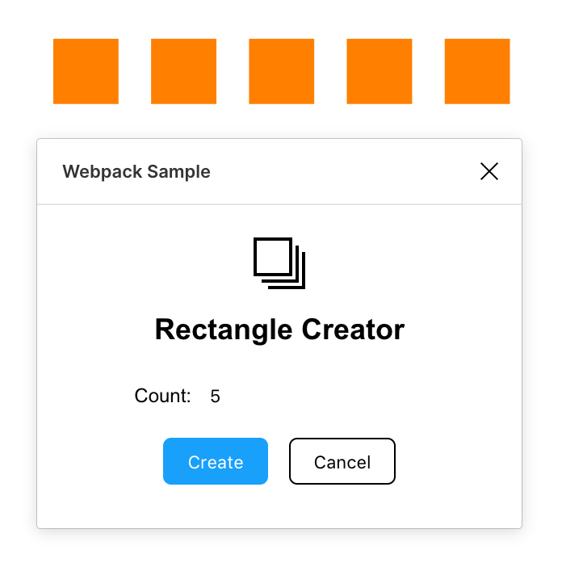

# Webpack 

Creates rectangles. Demonstrates bundling plugin code using Webpack.

The main plugin code is in `src/code.ts`. The HTML for the UI is in
`src/ui.html`, while the embedded JavaScript is in `src/ui.ts`.

These are compiled to files in `dist/`, which are what Figma will use to run
your plugin.

To build:

    $ npm install
    $ npx webpack
